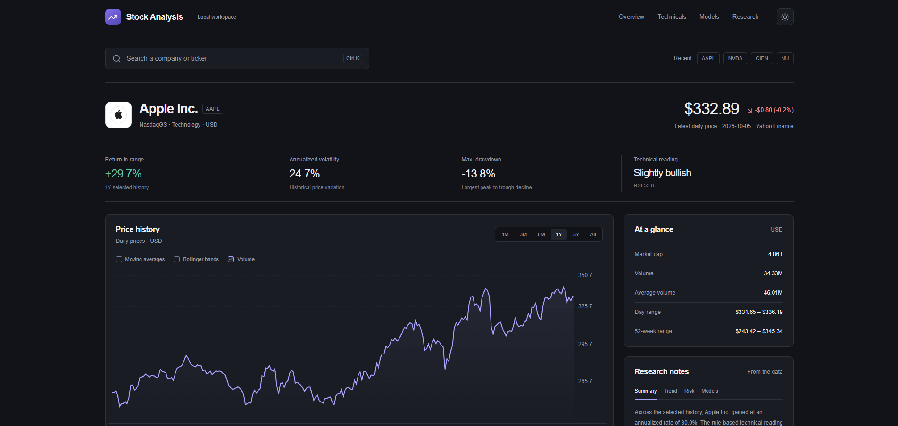

# Stock Analysis

Stock Analysis is a local-first workspace for exploring stocks, evaluating
forecasting models, and testing strategies against historical market data.
Search a company, inspect its price history and risk metrics, then use the
research lab to compare models, replay a past date, or run a cost-aware backtest.



Dashboard snapshot provided on October 5, 2026. Prices shown are historical,
not live quotes.

Built with React and TypeScript (Vinext/Vite), FastAPI, pandas/NumPy,
scikit-learn, and SQLite.

The application is intentionally careful with forecasts: models are evaluated
on later, unseen observations, no time-series rows are shuffled, uncertainty
ranges are displayed, and all estimates are labeled experimental.

## What is included

- Search by ticker or company name, with recent searches stored in the browser
- Debounced autocomplete for company names such as Ciena → CIEN
- Yahoo Finance company overview and historical OHLCV data
- Interactive ranges from one month through maximum available history
- Moving-average and Bollinger Band overlays
- Return, volatility, drawdown, Sharpe, Sortino, Calmar, VaR, expected
  shortfall, beta, and SPY correlation metrics
- RSI, MACD, ATR, momentum, support/resistance, and crossover signals
- A published weighted risk-score formula
- Linear Regression, Random Forest, and last-close baseline across three expanding test windows
- Independent interval calibration, unseen coverage, baseline improvement, and normalized RMSE
- Multi-stock evaluation (up to three tickers per run)
- Historical replay with an explicit future-outcome reveal
- Cost-aware moving-average and linear-model backtests, buy-and-hold comparison, and CSV trade ledger
- Persistent SQLite research queue, immutable datasets, saved model artifacts, progress, and bounded retries
- Deterministic insight text composed only from calculated metrics
- Company logos in search results and the selected company header, with initials as a fallback
- Explicit sample mode when the local API is offline (never silently substituted)
- Responsive light and dark themes with a saved browser preference
- In-card loading states, measured logo transitions, and left-to-right chart reveal motion
- One-command startup for the dashboard and local API

## Performance design

- Large histories are reduced to at most 650 rendered points with the
  linear-time Largest-Triangle-Three-Buckets algorithm, preserving peaks and
  turning points instead of naively dropping every nth row.
- Yahoo history, company search, overview data, and complete dashboard
  responses use bounded TTL/LRU caches with O(1) lookup and eviction.
- Dashboard JSON is gzip-compressed, stale browser requests are cancelled, and
  company-name lookup is debounced.
- The chart is memoized so typing in search does not rerender thousands of SVG
  nodes. Expensive per-point chart tweening is replaced by one composited
  left-to-right reveal.
- Model training uses the latest 2,500 valid chronological observations, which
  bounds runtime without shuffling. One background worker trains models with
  a single CPU thread; the dashboard endpoint does not train models.

NumPy, pandas, and scikit-learn already execute their heavy numerical kernels
in compiled native code. A separate C/C++ service would add deployment and
memory-safety complexity without improving the browser's graph-rendering
bottleneck.

## Research lab

The **Research** section has four views:

- **Evaluation:** the selected stock evaluates automatically in the background.
  Add up to two comparison tickers and run a fresh evaluation. Each model is
  tested across three expanding chronological windows, with a one-row boundary
  gap so a training label cannot cross into the next split. Within each training
  window, a separate recent slice calibrates absolute-residual intervals. The
  final forecast model stays frozen after calibration; it is not refitted on the
  calibration observations. Coverage is an observed test metric, not a guarantee.
  Positive baseline improvement means lower RMSE than carrying forward today's close.
- **Replay:** choose a historical cutoff within five years. Indicators, model
  training, and charts use only the prefix through that date. Future prices are
  fetched from the same frozen snapshot only when you click Reveal. The first
  future session is checked against each frozen one-session forecast.
- **Backtest:** run a long-only 20/50-day moving-average strategy or linear-model
  strategy. The latter retrains every 20 sessions, using only labels that have
  matured by the signal date. Signals at the prior close execute at the next
  open. Fees/slippage apply to entry and exit, including buy-and-hold. Both
  portfolios liquidate at the final close. Blank dates use the latest ~252
  sessions; a run is capped at 1,250 sessions. Export the complete trade ledger.
- **Saved runs:** reopen the latest 20 runs, including interrupted/failed runs.
  Dataset checksums, parameters, fitted-model hashes, library versions, seed,
  and a source-derived engine version are recorded. Full results export as JSON.

Research is stored in ignored `backend/.cache/research.sqlite3` and
`backend/.cache/models/`. Snapshots are immutable and content-addressed. Do not
delete that directory if you want to retain experiments. Identical input/version
requests reuse a job within a 15-minute freshness bucket. “Run fresh evaluation”
bypasses the price-history cache. Historical jobs can also reuse a particular
snapshot through the API's `snapshot_id` parameter.
Set `STOCK_RESEARCH_DIR` to an absolute path for an isolated local research database.

The queue accepts at most 20 pending runs. One worker processes them serially;
temporary provider failures retry for up to three attempts. On restart, jobs
marked running return to the queue. This is deliberately a **single-process,
local prototype**, not a distributed queue: don't start multiple API workers
against the same database. Runs execute only while the API is running. Saved
models are locally generated artifacts, not user-uploaded executable pickles.

### Scientific limitations

Replay/backtesting is a **historical reconstruction**, not true point-in-time
market data: Yahoo history retrieved today may include later corrections and
corporate-action adjustments. The code prevents post-cutoff observations from
entering replay calculations, but cannot undo provider revisions. Daily bars
also cannot model intraday execution, liquidity, tax, or market impact.
Current-session daily bars may still be incomplete; forecasts and simulations
use the provider's captured daily-bar values, not a live execution feed.

Backtests scale all OHLC prices by `Adj Close / Close`, using synthetic adjusted
price units rather than raw shares. This incorporates the provider's split and
dividend adjustments without double-counting cash dividends, but is not an
exact brokerage dividend-reinvestment model. Overview metrics and model
evaluations use daily closing prices; backtest metrics use adjusted prices and
net simulated equity. These are deliberately different experiments.

## Project structure

```text
app/                         React/TypeScript dashboard
  components/
    ResearchWorkbench.tsx    Evaluation, replay, backtest, and saved-run views
    useResearchJob.ts        Background-job submission and polling
backend/
  app/main.py                FastAPI endpoints
  app/services/
    market_data.py           Yahoo Finance retrieval and normalization
    analytics.py             Statistics, indicators, and risk scoring
    prediction.py            Feature engineering and model evaluation
    backtest.py              Cost-aware next-open strategy simulation
    replay.py                Cutoff-only reconstruction and outcome reveal
    jobs.py                  Serial worker, retries, and process ownership
    storage.py               SQLite queue and immutable dataset snapshots
    insights.py              Metric-grounded narrative composer
  tests/                     Analytics, causality, storage, and queue tests
tests/                       Frontend rendering, API proxy, and startup checks
scripts/                     App startup and optional live integration check
docs/images/                 README screenshots
public/                      Browser and social-preview assets
```

## Prerequisites

- Node.js 22.13 or newer
- Python 3.10 or newer

## Run locally

Use a terminal in the repository root. First-time setup:

### 1. Install dependencies

PowerShell:

```powershell
python -m venv backend/.venv
backend/.venv/Scripts/python.exe -m pip install -r backend/requirements.txt
npm.cmd install
```

macOS or Linux:

```bash
python3 -m venv backend/.venv
backend/.venv/bin/python -m pip install -r backend/requirements.txt
npm install
```

### 2. Start the app

PowerShell (use `npm.cmd` to avoid Windows blocking `npm.ps1`):

```powershell
npm.cmd run dev
```

```bash
npm run dev
```

That command starts **both** the API and the website. Open the local URL printed
by the web server (normally `http://localhost:3000`). If port 3000 is occupied, it
will print a different port. Ctrl+C stops the services started by this command.
The website hot-reloads frontend edits. Restart the command after backend edits.
The launcher refuses to reuse an older API version; stop the old server first.

The browser uses same-origin `/api` requests; the server forwards them to the
local Python API. The default API port is 8010. If Windows blocks it:

```powershell
$env:STOCK_API_PORT = "8020"
npm.cmd run dev
```

To use an API that is already running elsewhere, set `STOCK_API_URL` to its
origin (for example `http://127.0.0.1:8000`). This is a server-only setting.
`npm.cmd run dev:web` starts just the website when you manage the API separately.
API health: `/api/health` on the website; interactive API docs:
`http://127.0.0.1:8010/docs`.

Yahoo Finance must be reachable for live data. Provider cookies and timezone
data are cached inside ignored `backend/.cache/`, rather than a user-profile
folder. Company icons are retrieved from company website favicons via Google's
fixed image endpoint and cached for 24 hours. Some companies do not have a
usable icon; their initial remains visible instead of a broken image.

## Verification

```powershell
$env:PYTHONPATH = "backend"
backend/.venv/Scripts/python.exe -m pytest backend/tests -q
npm.cmd run lint
npx.cmd tsc --noEmit
npm.cmd test
```

Optional live integration check (with the API running):

```powershell
backend/.venv/Scripts/python.exe -u scripts/smoke_research.py --url http://127.0.0.1:8010
```

This downloads real data and creates local saved runs; it never sends orders.
The normal test suite uses deterministic fixtures and does not require network access.

## API surface

- `GET /api/health`
- `GET /api/stocks/search?q=apple`
- `GET /api/stocks/AAPL/dashboard?period=1y`
- `GET /api/stocks/AAPL/logo`
- `POST /api/jobs` — `kind`: `analysis`, `replay`, or `backtest`; `symbols`: ticker list
- `GET /api/jobs` — latest 20 runs
- `GET /api/jobs/{id}` — progress and saved results
- `GET /api/replays/{id}/reveal?steps=1` — explicit reveal, up to 60 sessions
- `GET /api/jobs/{id}/ledger` — completed backtest CSV

Supported periods are `1m`, `3mo`, `6mo`, `1y`, `5y`, and `max`.
Research jobs accept `1y`, `5y`, or `max`. The interactive API docs describe
date/cost/capital limits and all request fields.

## Risk formula

The overall score is not an AI opinion. It uses:

- 28% annualized volatility
- 26% maximum drawdown
- 14% beta
- 14% 95% daily Value at Risk
- 12% downside deviation
- 6% recent-versus-long-term volatility regime

Each component is normalized to a 0–100 scale before weighting.

## Forecast limitations

Forecasts are experiments based on historical prices, volume, and derived
features. They cannot anticipate news, earnings surprises, macroeconomic
shocks, liquidity changes, or other unexpected events. Past performance does
not guarantee future results. Stock Analysis does not provide financial advice.

## Dependency security

Compatible React and Next.js security patches are installed. The dependency
audit still reports nine high-severity advisories in the current Vinext toolchain
(image parsing and glob-pattern denial of service). Resolving these requires a
separately tested framework migration. Keep this prototype local; do not expose
the development server publicly. Run `npm.cmd audit` before any deployment.
